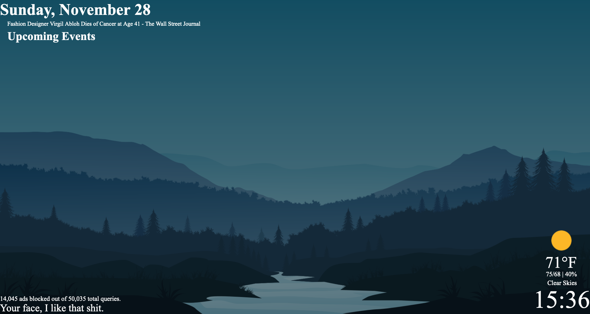

# Welcome Display
This is a welcome display made for my house, it keeps me up to date on the following:

  * Appointments in my Google Calendar
  * Weather
  * PiHole Ad's blocked/Queries made
  * Google's News
  * Random sayings/quotes
  * Countdown for Halloween and Christmas




## Why did you make this?...
I made this because I saw the [MagicMirror](https://github.com/MichMich/MagicMirror) and was like, "that's a really neat project!". But I wanted to learn more about Python and needed a project. Thus I challenged myself to make a version similar to the Magic Mirror but more closly related to Chromecast's look and feel. I also wanted to create it in Python instead of Javascript. I had previously builds of this application using Tkinter, PyQT5, and Django but settled on Flask as it was the most stable over long periods of time. I made this for myself, and didn't really particularly consider putting it out there but figured might as well, no harm. As such in order to run this you will need to update some of the code to match your particular settings or desires. I run this on a Raspberry Pi 3 with a 1080P monitor sitting in my kitchen so while I'm making coffee before heading to work I can glance and see the weather, a headline or two, and see if I've got any appointments on my Calendar. 

**This is for local network use only, do not publish this on the open internet.**

## Setup

If you are interested in using this you will need to edit the code a bit to reflect what you want, but it's fairly simple!

### Download the repository:

  1. `git clone` this repository
  2. `python3 -m venv venv`
  3. `source venv/bin/activate` 
  4. run `pip install -r requirements.txt` which will install the required modules for python to run

Optional:
If you would like to run this on port 80, you should do the following:
  1. Install authbind (debian): `sudo apt install authbind`
  2. `sudo touch /etc/authbind/byport/80`
  3. `sudo chmod 777 /etc/authbind/byport/80`
  4. Change line 269 in `main.py` to port `80` instead of `8080`


### Weather:

  1. Register and setup an account with [Open Weather Map](https://openweathermap.org/current) and setup a Current API
  2. Get your Zip code, and your API Key, and edit `main.py` lines 86 and 87. 

```
apiKey = "INSERT YOUR API KEY HERE"
zip = 'ENTER YOUR ZIP CODE HERE'
```

### Birthday:
  1. Go to line 77 and 78
  2. Update the MONTH and DATE with your particular month and date `01, 22` for Jan 22 (see code below)
  3. Update the message displayed.
```
elif other_date.strftime('%m, %d') == '01, 22':
    message = 'Happy birthday!'
```

### Backgrounds:
Drop images within the appropraite folder. I typically stick to 1920 X 1080 images because I have a 22" 1080P monitor in my kitchen where this application exists. I have added 5 images in each folder to start you off but feel free to add as many as you want! Towards the bottom of this ReadMe are all of the credits for each image used. 

### Random Messages
Edit line 56's `msg_list` variable and add whatever you want to be posted whenever the page refreshes. 

### Fonts
Download and install Google's [Roboto Font](https://fonts.google.com/specimen/Roboto)

### Running the code
If you chose to leave it with port `8080`

 - `python3 main.py`

OR if you wanted to use port 80:

 - `authbind --deep python3 main.py`

#### Discord bot

**RUN THIS AT YOUR OWN RISK**

Some background, I have never programmed a Discord bot before, this is my first attempt at one, and it seems to be pretty steady so I just threw it up for fun. The code works great for the occassional wallpaper found on your various subreddits/wallpaper websites. Eventually I'll probably add in a bulk add, and maybe get rid of the requirement for the end to be a `.jpg`, `.png`, or a `.jpg` but wanted to also code it for safety so your not downloading malicious stuff. Hence the mime type checks. The log keeps a running list of all the requests users have submitted as well including all the links and time stamps so if you need to go back and look you can trace it back. 

 If you want the discord bot, you'll need to follow these instructions to [setup a private bot](https://discordjs.guide/preparations/setting-up-a-bot-application.html#your-token). Then at the _very_ bottom of the `discord_image_bot.py` script you'll see `client.run('<YOUR CLIENT SECRET HERE>')`. Input your client secret there, and then run the following command to run the python bot. **DO NOT SHARE THAT CLIENT SECRET WITH ANYONE, THIS IS LIKE A PASSWORD, KEEP IT SAFE.**
 
 - `nohup python3 discord_image_bot.py &` 

 You can then check if the bot is up and running by sending a message in the appropriate channel: `$help`

 ```
Help menu for Pickles the Wallpaper Mage:
There are five folders you can save to: america, birthday, christmas, halloween and normal.
Currently there are only two supported file types: .jpg, .jpeg, or .png.
Select a folder to download to by running $d<beginning letter of folder name> <imageurl>.
For example if you wanted to download an image to the normal folder you would run the following comand:

$dn <url to image>
```

I have hard coded the name "Pickles the Wallpaper Mage", however feel free to change it on line 40! When you setup your bot, you'll be able to adjust the name there and set your own customized picture to fit your theme for your particular Discord.


### Making things pretty
1. Just pop open my perfered Web Browser and browse to either `localhost:8080` or `localhost` depending on which port you choose.
2. Set this as your home page
3. Full screen the Web Browser

Enjoy!


## Facts and Questions:

Question: I'm getting this super sketchy Google Prompt for me to login, is this safe?... Will you see all my data?
  - Answer: NO I will not, nor am I interested in any of your data. I utilized the default script for [Google Calendar's API](https://developers.google.com/calendar/api/quickstart/python) so feel free to read through the code and validate nothing sketchy is going on! The script will prompt you to login and trust the application to view your Calendar.

Question: Can I change how often the page refreshes? It Seems too [Slow / Fast].
  - Answer: Yes you can! See line 10 under `./static/templates/index.html` and adjust the following to match your needs. (300 seconds = 5 mins)

```
<meta http-equiv="refresh" content="300" />
```

## Image Authors/Credit
If you like the added backgrounds, please consider supporting these amazing creators!!

### America
- 1.png - Image by <a href="https://pixabay.com/users/clker-free-vector-images-3736/?utm_source=link-attribution&amp;utm_medium=referral&amp;utm_campaign=image&amp;utm_content=26177">Clker-Free-Vector-Images</a> from <a href="https://pixabay.com/?utm_source=link-attribution&amp;utm_medium=referral&amp;utm_campaign=image&amp;utm_content=26177">Pixabay</a> 
- 2.png - Image by <a href="https://pixabay.com/users/alexey_hulsov-388655/?utm_source=link-attribution&amp;utm_medium=referral&amp;utm_campaign=image&amp;utm_content=2419220">Alexey Hulsov</a> from <a href="https://pixabay.com/?utm_source=link-attribution&amp;utm_medium=referral&amp;utm_campaign=image&amp;utm_content=2419220">Pixabay</a>

### Birthday
- 1.png - Image by <a href="https://pixabay.com/users/gdj-1086657/?utm_source=link-attribution&amp;utm_medium=referral&amp;utm_campaign=image&amp;utm_content=1301860">Gordon Johnson</a> from <a href="https://pixabay.com/?utm_source=link-attribution&amp;utm_medium=referral&amp;utm_campaign=image&amp;utm_content=1301860">Pixabay</a>
- 2.png - Image by <a href="https://pixabay.com/users/openclipart-vectors-30363/?utm_source=link-attribution&amp;utm_medium=referral&amp;utm_campaign=image&amp;utm_content=154242">OpenClipart-Vectors</a> from <a href="https://pixabay.com/?utm_source=link-attribution&amp;utm_medium=referral&amp;utm_campaign=image&amp;utm_content=154242">Pixabay</a>

### Christmas
- 1.jpg - Image by <a href="https://pixabay.com/users/larisa-k-1107275/?utm_source=link-attribution&amp;utm_medium=referral&amp;utm_campaign=image&amp;utm_content=2928142">Larisa Koshkina</a> from <a href="https://pixabay.com/?utm_source=link-attribution&amp;utm_medium=referral&amp;utm_campaign=image&amp;utm_content=2928142">Pixabay</a>
- 2.png - Image by <a href="https://pixabay.com/users/pixaline-1569622/?utm_source=link-attribution&amp;utm_medium=referral&amp;utm_campaign=image&amp;utm_content=1869533">Pixaline</a> from <a href="https://pixabay.com/?utm_source=link-attribution&amp;utm_medium=referral&amp;utm_campaign=image&amp;utm_content=1869533">Pixabay</a>
- 3.png- Image by <a href="https://pixabay.com/users/aalmeidah-4277022/?utm_source=link-attribution&amp;utm_medium=referral&amp;utm_campaign=image&amp;utm_content=4701783">aalmeidah</a> from <a href="https://pixabay.com/?utm_source=link-attribution&amp;utm_medium=referral&amp;utm_campaign=image&amp;utm_content=4701783">Pixabay</a>
- 4.jpg - Image by <a href="https://pixabay.com/users/kirillslov-8058952/?utm_source=link-attribution&amp;utm_medium=referral&amp;utm_campaign=image&amp;utm_content=4711725">kirillslov</a> from <a href="https://pixabay.com/?utm_source=link-attribution&amp;utm_medium=referral&amp;utm_campaign=image&amp;utm_content=4711725">Pixabay</a>
- 5.png - Image by <a href="https://pixabay.com/users/openclipart-vectors-30363/?utm_source=link-attribution&amp;utm_medium=referral&amp;utm_campaign=image&amp;utm_content=153926">OpenClipart-Vectors</a> from <a href="https://pixabay.com/?utm_source=link-attribution&amp;utm_medium=referral&amp;utm_campaign=image&amp;utm_content=153926">Pixabay</a>

### Halloween
- 1.jpg - Image by <a href="https://pixabay.com/users/quincecreative-1031690/?utm_source=link-attribution&amp;utm_medium=referral&amp;utm_campaign=image&amp;utm_content=2837936">3D Animation Production Company</a> from <a href="https://pixabay.com/?utm_source=link-attribution&amp;utm_medium=referral&amp;utm_campaign=image&amp;utm_content=2837936">Pixabay</a>
- 2.jpg - Image by <a href="https://pixabay.com/users/biljast-2868488/?utm_source=link-attribution&amp;utm_medium=referral&amp;utm_campaign=image&amp;utm_content=5596921">Biljana Jovanovic</a> from <a href="https://pixabay.com/?utm_source=link-attribution&amp;utm_medium=referral&amp;utm_campaign=image&amp;utm_content=5596921">Pixabay</a>
- 3.jpg - Image by <a href="https://pixabay.com/users/myriams-fotos-1627417/?utm_source=link-attribution&amp;utm_medium=referral&amp;utm_campaign=image&amp;utm_content=2893710">Myriams-Fotos</a> from <a href="https://pixabay.com/?utm_source=link-attribution&amp;utm_medium=referral&amp;utm_campaign=image&amp;utm_content=2893710">Pixabay</a>
- 4.jpg - Image by <a href="https://pixabay.com/users/bany_mm-2218778/?utm_source=link-attribution&amp;utm_medium=referral&amp;utm_campaign=image&amp;utm_content=5674148">Bany_MM</a> from <a href="https://pixabay.com/?utm_source=link-attribution&amp;utm_medium=referral&amp;utm_campaign=image&amp;utm_content=5674148">Pixabay</a>
- 5.jpg - Image by <a href="https://pixabay.com/users/susan-lu4esm-7009216/?utm_source=link-attribution&amp;utm_medium=referral&amp;utm_campaign=image&amp;utm_content=4573176">Susan Cipriano</a> from <a href="https://pixabay.com/?utm_source=link-attribution&amp;utm_medium=referral&amp;utm_campaign=image&amp;utm_content=4573176">Pixabay</a>

### Normal
- 1.png - Image by <a href="https://pixabay.com/users/moinzon-2433302/?utm_source=link-attribution&amp;utm_medium=referral&amp;utm_campaign=image&amp;utm_content=1412683">Michi S</a> from <a href="https://pixabay.com/?utm_source=link-attribution&amp;utm_medium=referral&amp;utm_campaign=image&amp;utm_content=1412683">Pixabay</a>
- 2.png - Image by <a href="https://pixabay.com/users/lobsarts-19515294/?utm_source=link-attribution&amp;utm_medium=referral&amp;utm_campaign=image&amp;utm_content=5889923">LOBS Arts</a> from <a href="https://pixabay.com/?utm_source=link-attribution&amp;utm_medium=referral&amp;utm_campaign=image&amp;utm_content=5889923">Pixabay</a>
- 3.png - Image by <a href="https://pixabay.com/users/chakkree_chantakad-15107399/?utm_source=link-attribution&amp;utm_medium=referral&amp;utm_campaign=image&amp;utm_content=4821583">Chakkree Chantakad</a> from <a href="https://pixabay.com/?utm_source=link-attribution&amp;utm_medium=referral&amp;utm_campaign=image&amp;utm_content=4821583">Pixabay</a>
- 4.png - Image by <a href="https://pixabay.com/users/chakkree_chantakad-15107399/?utm_source=link-attribution&amp;utm_medium=referral&amp;utm_campaign=image&amp;utm_content=4824761">Chakkree Chantakad</a> from <a href="https://pixabay.com/?utm_source=link-attribution&amp;utm_medium=referral&amp;utm_campaign=image&amp;utm_content=4824761">Pixabay</a>

### Weather Icons:
Created by [Alexey Onufriev](https://dribbble.com/onufriev)

